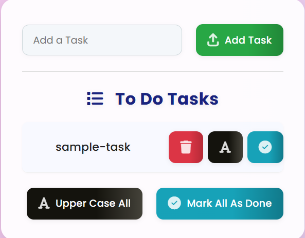

# Todo-List

A simple ToDo List application built with React and Vite.

## Features

- Add, view, and manage tasks
- Modern React component structure
- Clean and responsive UI

## Getting Started

1. Install dependencies:
   ```bash
   npm install
   ```
2. Start the development server:
   ```bash
   npm run dev
   ```

## Project Structure

- `src/` – Main source code
- `public/` – Static assets
- `.gitignore` – Ignores unwanted files for Git

## License

## UI Screenshot



This project is licensed under the MIT License.

## Connect

[LinkedIn – harilal-sah9](https://www.linkedin.com/in/harilal-sah9/)
